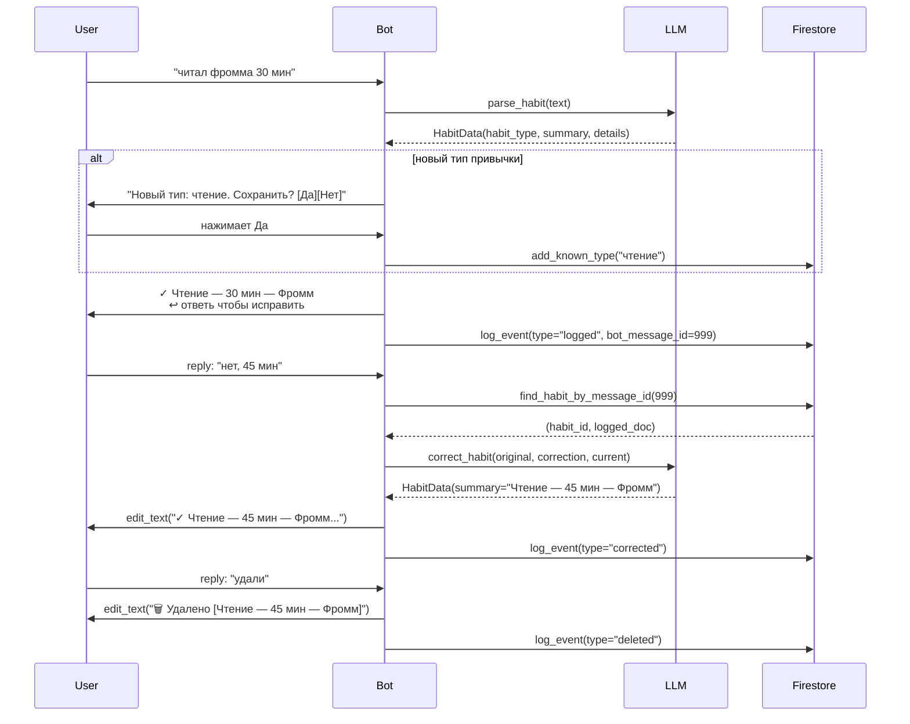
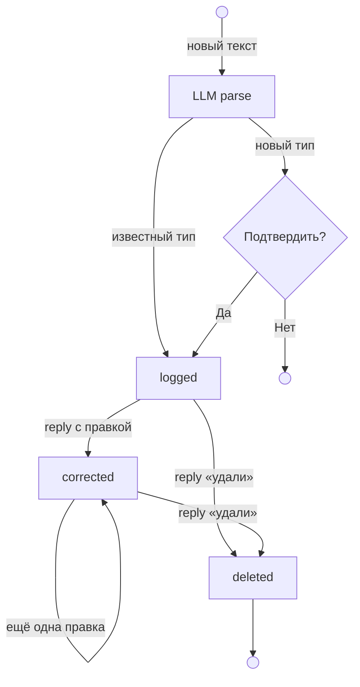

# kaizendo_bot

Telegram-бот для трекинга привычек одного пользователя через plain text.
Вдохновлён книгой «Атомные привычки» — маленькие ежедневные шаги складываются в результат.
Хранит историю как поток неизменяемых событий (event sourcing) в Firestore.

## Поток сообщений



## Жизненный цикл привычки



## Ключевые файлы

```
src/bot/
├── main.py                  # точка входа, настройка webhook
├── models.py                # HabitData dataclass
├── handlers/
│   ├── basic.py             # /start, /ping, /today
│   └── habits.py            # обработка входящих сообщений и reply
└── services/
    ├── llm.py               # LLMService — парсинг и коррекция через OpenRouter
    └── storage.py           # StorageService — запись/чтение событий в Firestore
tests/
```
